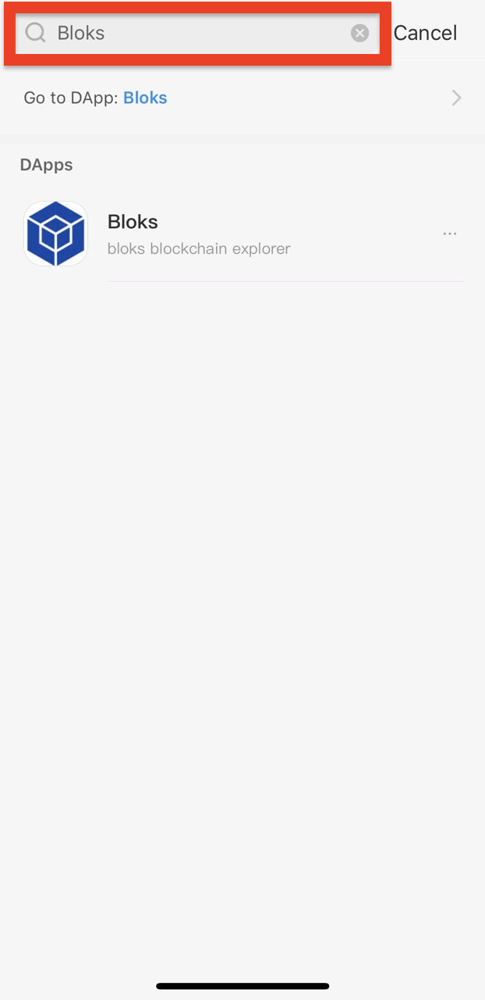

# Staking + Unstaking

With EOS, you are able to stake or unstake it. Staking means you are locking down your tokens to give you access to resources \(CPU and NET\) that you need to perform actions on the blockchain. 


The process of unstaking your EOS takes a **total of 72 hours** from the moment you click unstake to when you will have full access to move the EOS. This is a security feature to add a three-day buffer incase your keys may be compromised. Staking your EOS can add this layer of security for your account.  


## HOW TO STAKE EOS

### 1. Select **Wallet** on the top menu.

### 2. Select **Stake CPU/NET** from the left side menu.

### 3. If you are logged into your account via a wallet supported by Bloks \(Scatter, Ledger, etc.\), the field Receiver of Stake should be autofilled.

### 4. Enter in the **Amount of CPU/NET to Stake \(in EOS\)**. To make the process more simple, there are buttons to select a percentage of your EOS holdings - 25, 50, 75 and 100%.

### 5. Click the blue button to confirm the amount of CPU/NET you are staking.

## HOW TO UNSTAKE EOS

1. 

